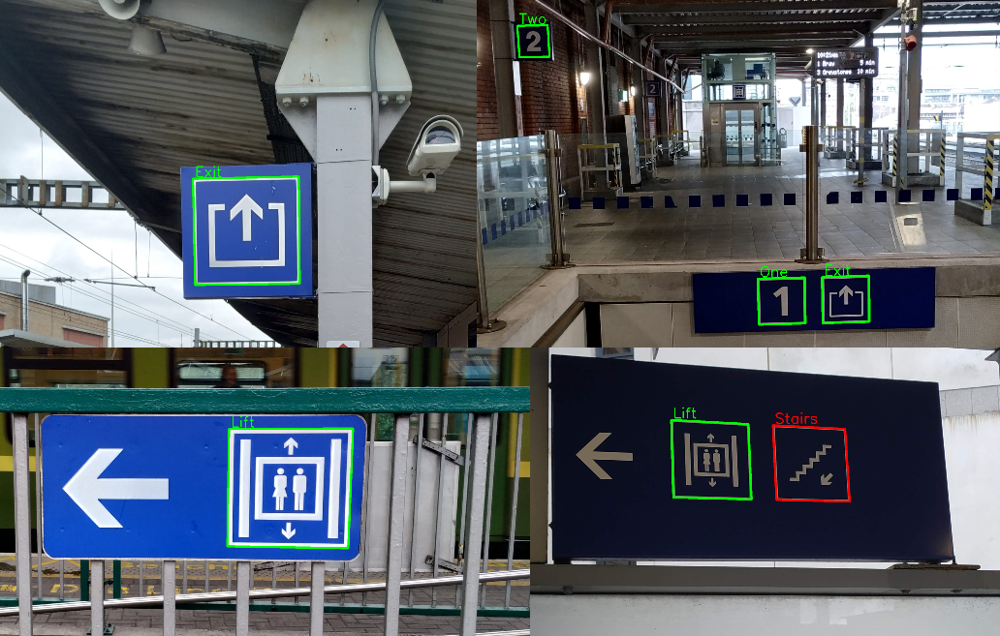

# Blue Sign Location & Recognition
Kenneth Dawson-Howe's Computer Vision course.

## Description

The problem is to develop a program in C++ to locate and recognise 81 information signs from Dublin train stations in the 33 provided images.

## Environment Setup
- This project uses openCV v3.2. Unix download is available from [here](https://sourceforge.net/projects/opencvlibrary/files/opencv-unix/3.2.0/opencv-3.2.0.zip/download).
- CMake available from [here](https://cmake.org/download/).
- You may have to add `export OpenCV_DIR=/usr/local/share/OpenCV` to your `bash_profile`
  so that CMake will know where to find OpenCV libraries.

## Building and running
1. Make a build directory and navigate to it to keep your workspace clean.
   
   `mkdir build`
   
   `cd build`

2. GNU header files are used in this project so make sure you use GNU compiler instead of clang when invoking CMake.

   `cmake -DCMAKE_C_COMPILER=/usr/local/bin/gcc-9 -DCMAKE_CXX_COMPILER=/usr/local/bin/g++-9 ..`
2. Build the binary executable.
   
   `make`