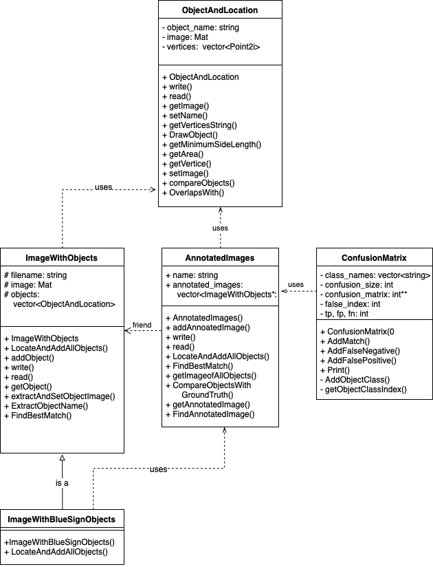
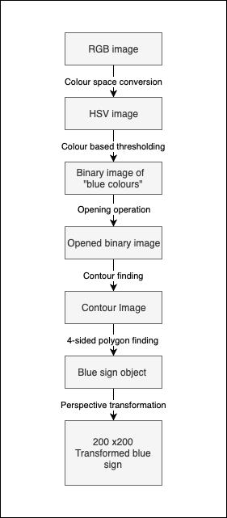
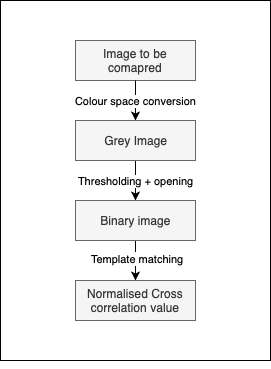
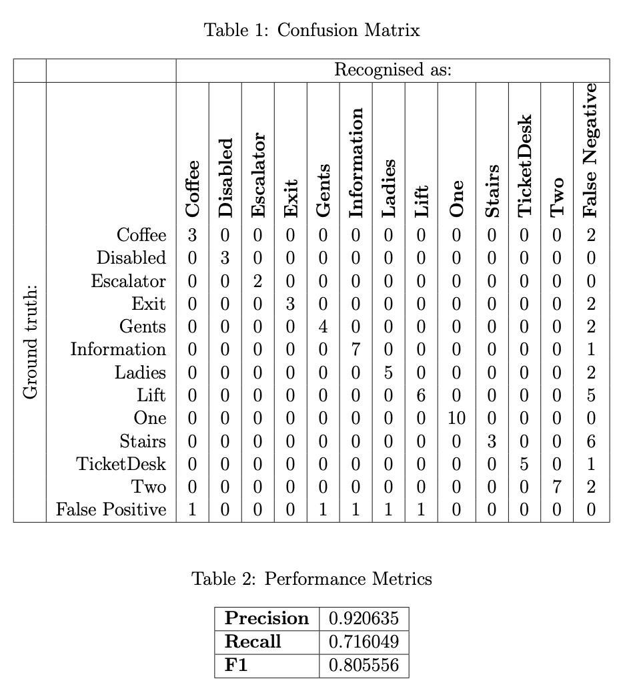

# Blue Sign Location & Recognition
Kenneth Dawson-Howe's Computer Vision course.

## Description

The problem is to develop a program in C++ to locate and recognise 81 information signs from Dublin train stations in the 33 provided images.

## Environment Setup
- This project uses openCV v3.2. Unix download is available from [OpenCV](https://sourceforge.net/projects/opencvlibrary/files/opencv-unix/3.2.0/opencv-3.2.0.zip/download).
- CMake available from [CMake](https://cmake.org/download/).
- In order to `#include filesystem` with Clang compiler you wil need Boost library available from [Boost](https://www.boost.org/doc/libs/1_71_0/more/getting_started/index.html). 
- You may have to add `export OpenCV_DIR=/usr/local/share/OpenCV` to your `bash_profile`
  so that CMake will know where to find OpenCV libraries.

## Building and running
1. Make a build directory and navigate to it to keep your workspace clean.
   
   `mkdir build`
   
   `cd build`

2. `cmake ..`
  
3. Build the binary executable.
   
   `make`

4. To run the program, you must be in the base directory (i.e. the one containing the "Blue Signs" folder)

   `cd ..`

   `build/blueSignRecognition `

## Class Diagram

- `ObjectAndLocation::compareObjects()` perfroms recognition of blue signs.
- `ImageWithBlueSigns::LocateAndAddAllObjects()` performs detection of blue signs.

# Theory 

## Summary of procedure for detection of blue signs.

## Summary of procedure for recognition of blue signs.

# Results
